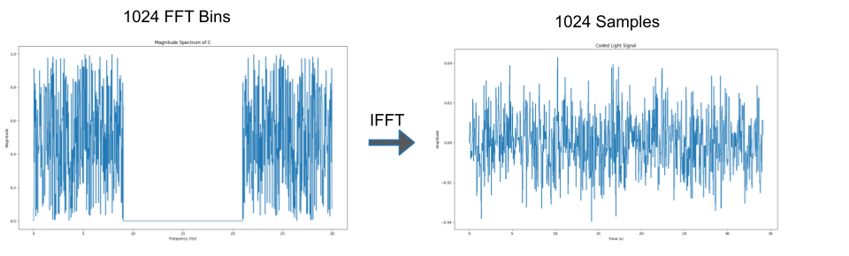
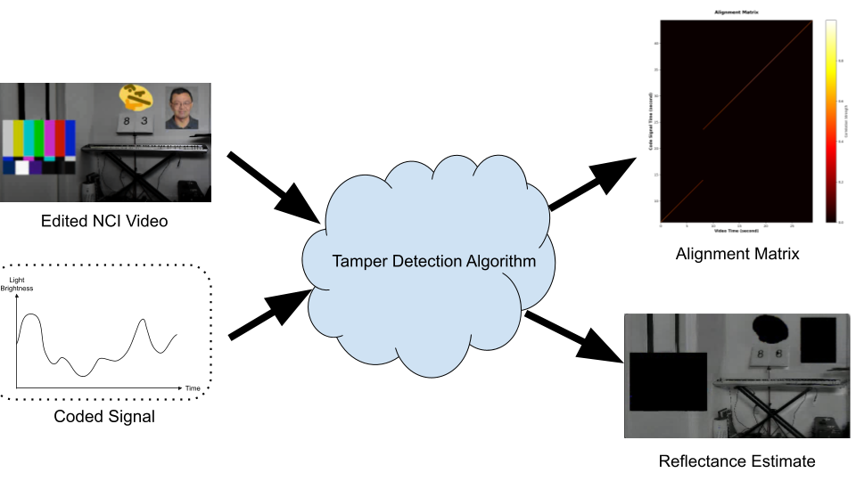
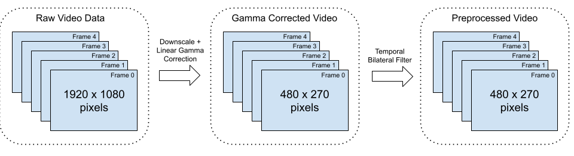
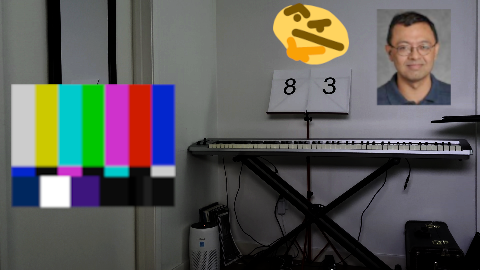
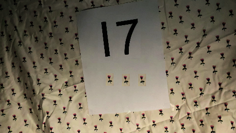
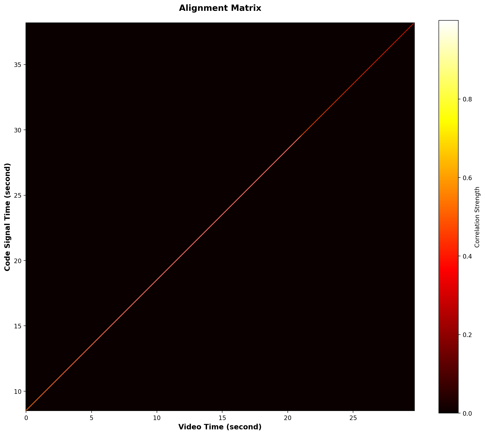

# **Lights Under Attack: Stress-Testing Noise-Coded Illumination**

<!-- *A concise, descriptive title for your project.* -->

<!--   
*(Optional: Replace with a conceptual figure or meaningful image.)* -->

---

## 👥 **Team**

- Maxwell Jung (<maxwelljung@ucla.edu>, [GitHub](https://github.com/MaxwellJung))  
- Wentao Chen (<wentac4@ucla.edu>, [GitHub](https://github.com/wentac4))  
- Steve Zang (<zangbruin007@ucla.edu>, [GitHub](https://github.com/SteveZ-Cal))  

---

## 📝 **Abstract**

Noise-Coded Illumination (NCI) is recognized for its potential to provide robust forensic authentication for video footage. Existing research has demonstrated its capability to embed and recover temporal watermarks, creating a powerful asymmetry against manipulators. However, there remains limited exploration into the resilience of NCI against informed adversarial attacks, where an attacker with knowledge of the system attempts to bypass detection. This project aims to assess the security of NCI by evaluating several attack strategies under realistic conditions. Our work will implement a baseline NCI pipeline and systematically test adversarial bypass methods, analyzing their success and proposing potential countermeasures to guide the secure deployment of this promising technology.

---

## 📑 **Slides**

- [Midterm Checkpoint Slides](https://docs.google.com/presentation/d/1JbTUeoli6I7b-AFx3gMX-jX8nmnHsw5_VxXokDmLpW4/edit?usp=sharing)  
- [Final Presentation Slides](https://docs.google.com/presentation/d/1eZMDApG3otnrJUzfvpvx2tNXskiX9aYgf0qJhQyEvnM/edit?usp=sharing)

---

## 🎛️ **Media**

- [38_edited_sampling_mult.mp4](https://drive.google.com/file/d/1c9GZ5Hwqy3Y4azfgi7JGC7BIhy3PX_Uh/view?usp=drive_link)
- [38_edited_sampling_mult_r_estimate.mp4](https://drive.google.com/file/d/12FuLq4AwDjDIo_oq-uR6NVYgyKB8aj5g/view?usp=drive_link)
- [71_edited_sampling_mult.mp4](https://drive.google.com/file/d/1hTYSCr0sIotjzVKb_edzKM9ds5cwCqVf/view?usp=drive_link)
- [71_edited_sampling_mult_r_estimate.mp4](https://drive.google.com/file/d/10VK6CmIZM6dbS-KHPcc2woX5X1kfQxee/view?usp=drive_link)
- [Google Drive](https://drive.google.com/drive/folders/17nz-i6D9IX33ADJJrDn0S3bhEgEBukR5?usp=drive_link)

---

# **1. Introduction**

Producing realistic-looking fake videos has gotten easier due to advancements in video editing tools and generative AI. Malicious actors can use these videos to spread disinformation with catastrophic consequences; as a result, verifying the authenticity of videos is a vital and challenging task. Noise-Coded Illumination (NCI), proposed by Michael, Hao, Belongie, and Davis [1], is one method of watermarking a video using a special noise coded light source. Modifying a video captured under NCI can be easily detected by correlating the light’s code signal with the video signal. In this report, we attempt to test the limitations and weaknesses of NCI as informed adversaries who understand how NCI works. We demonstrate three attacks that can reliably bypass NCI’s watermarking.

### **1.1 Motivation & Objective**

NCI is a promising standard for watermarking videos as it requires minimal modification to video production setup. Any method that can bypass this watermark would diminish its ability to, at least in its current form, be deployed at a large scale, especially in particularly critical or high-stakes scenarios. Thus, this project seeks to explore and understand NCI’s weaknesses, in order to guide future research, and potentially inform avenues for future improvements upon the technique.

### **1.2 State of the Art & Its Limitations**

With the NCI paper by Michael et al. [1] having been published in June of 2025, the novel NCI watermarking technique it introduces has not yet had the chance to be extensively stress-tested or evaluated in terms of its susceptibility to various adversarial attacks, apart from a short preliminary discussion the authors themselves include in their paper and supplemental material. Here, the authors do briefly discuss some possible attacks that could foreseeably be launched against NCI, but they do not provide extensive evaluations of any such attacks against NCI. For example, they identify that potential manipulations that change the reflectance in a scene without changing its geometry or remapping time could potentially bypass NCI, but do not include extensive experimental evaluations of such techniques in their paper. As such, at present, there is very limited information available about the true degree of robustness/vulnerability of NCI to various potential adversarial attacks, which is a present limitation of the technique that must be addressed.

### **1.3 Novelty & Rationale**

We demonstrate three techniques to modify a video while preserving the NCI watermark, which present novel methods to attack NCI that not yet seen any extensive evaluation against the NCI watermarking method:

**Estimate the code signal c from the recorded video y alone, and evaluate how close it is to the real c.** As the code signals are embedded through the modulation of a light source illuminating the video's scene, if such modulation can be detected by those seeking to verify the video's authenticity, then it should also be detectable and then potentially extracted/estimated by an adversary.

**Modify pixel values by multiplying them with some constant $\alpha$.** Multiplying pixel values by a constant should maintain any underlying pixel variations.

**Modify pixel values by replacing the pixel with another pixel from**. Pixels from within the same video should include the same pixel variations coming from underlying code signal; if such pixels are moved to another part of the video, the underlying code signal should still remain intact.

### **1.4 Potential Impact**

If successful, the project will reveal fundamental vulnerabilities in the design of NCI. The findings of this project will hopefully improve future iterations of NCI.

### **1.5 Challenges**

Technical Challenges:

1. Staging light setup
2. Reproducing NCI pipeline

Methodological Challenges:

1. Devising attack methods
2. Confirming attack success

### **1.6 Metrics of Success**

1. RMSE between the extracted/extimated c code signal and the true, orignal c code signal.
2. RMSE between ideal Reflectance Estimate and actual Reflectance Estimate.
3. Time and resources required to execute the attack: computational cost (in seconds) and hardware/software resources needed to generate adversarial edits.

---

# **2. Related Work**

Fundamentally, our work seeks to identify potential vulnerabilities in the recent light-watermarking technique introduced by Michael et al. [1]. As new techniques emerge for watermarking recorded video content along efforts to prevent or at the very least allow for easy detection of attempts to manipulate recorded videos, before such techniques can be confidently and reliably deployed in high-stakes scenarios, their robustness or potential vulnerability to various attacks must be comprehensively verified.

One such family of techniques are singular value decomposition (SVD)-based watermarking schemes, such as the method proposed by Sathya and Ramakrishnan [2]. In this method, keyframes are selected based on the Fibonacci sequence, where the initial seeds of the Fibonacci sequence serve as the authentication key, and secret images, scrambled using the Fibonacci-Lucas transform, are embedded into the LH sub-band of selected frames, with singular values (SVs) of the scrambled watermark added to the SVs of selected frames [2]. Prasetyo et al. [3] attempt malicious attacks on this scheme and find it robust to attacks such as noise injection, cropping, scaling, etc. [4], but identify a weakness in this approach in terms of its susceptibility to the False-Positive-Problem (FPP), wherein counterfeit watermark images can easily be reconstructed by a malicious attacker. They find that by using singular vectors associated with arbitrary “counterfeit” images in the extraction process, even when using the correct key, the recovered watermark images appear nearly identical to the counterfeit images, making this method unsuitable for critical applications such as providing proof of copyright or ownership of a video [3]. Prasetyo et al. [3] then propose a fix for this vulnerability, by embedding the principal components of the watermark image (including left singular vectors and singular values), such that using counterfeit singular vectors no longer reconstructs a discernable watermark image.

Frame-by-frame video watermarking techniques such as spread-spectrum (SS)-based techniques [5], where noise-like signals generated from a key are embedded into the video, have also shown promise [6], but have also been found to be susceptible to attacks [7]. For example, SS-based watermarking schemes where each frame gets a different, pseudorandom watermark are susceptible to Temporal Frame Averaging (TFA) attacks, where adjacent frames are averaged in order to remove watermarking [7]. In fact, Doerr and Dugelay [7] show that even when this scheme is enhanced to prevent TFA attacks, such that the scheme now randomly chooses a watermark for each from from a finite set of orthonormal watermarks and the watermark detector checks for the presence of all watermarks in the set, a new, more sophisticated Watermark Estimation Clusters Remodulation (WECR) attack can still successfully remove the watermark.

Especially as Michael et al. [1] themselves assert that the NCI watermarking technique is closely related to direct sequence spread spectrum techniques to spread signal transmission over broad frequency bands through modulation with pseudorandom noise, the introduction of this novel watermarking technique brings along with it a gap in understanding of its robustness and vulnerability to potential adversarial attacks, which, should it be able to verify originality and prevent tampering of recorded videos in critical, high-stakes scenarios such those presented by the authors (such as political campaigning), must be comprehensively evaluated.

---

# **3. Technical Approach**

### **3.1 Recreating NCI Setup**

|  | 
|:--:| 
| Figure 1. NCI Video Recording Setup |

Noise coded light source is created by modulating the brightness of a light according to a “code signal” (referred to as c). According to Michael’s paper, the code signal must be a) random, b) zero-mean, c) uncorrelated with other code signals, and d) bandlimited to half of video frame rate. We achieve this is by generating the code signal in frequency-domain and transforming it to time-domain using Fourier Transform. Figure 2 shows that process. 9Hz bandlimit is chosen because it is less than half of 30 Hz, the target video frame rate. 1024 bins are chosen because it is the power of 2 closest to 1000. To ensure the final time-domain signal is real-valued, the first half of the spectrum must be a mirrored and complex conjugate version of the second half. 1024 point Inverse-FFT is used to convert the signal in frequency-domain to time-domain. Then, the time-domain code signal is scaled such that the maximum amplitude is 1. To play the code signal on a monitor, each value of the code signal is mapped to a greyscale value ranging from 0 (black) to 255 (white) and outputted at a rate of 30 Hz (monitor brightness changes every 1/30 seconds). After outputting all 1024 samples, the process is repeated with a new random 1024 frequency bins.

|  | 
|:--:| 
| Figure 2. Code Signal Generation |

To record a video, a scene is illuminated with the noise coded light source. Any light source can be used but we chose an LCD monitor for convenience. Video is recorded using iPhone 13/15/17 at 30fps in 1080p resolution. The video is exported as a .mov file.

### **3.2 Tamper Detection Algorithm**

|  | 
|:--:| 
| Figure 3. Tamper Detection Algorithm |

The goal of the tamper detection algorithm (src/analyze.py) is to generate an Alignment Matrix and Reflectance Estimate given a video and a code signal. The Alignment Matrix detects temporal manipulation while Reflectance Estimate detects spatial manipulation.

The first step in the tamper detection algorithm is to preprocess the video file. Figure 4 shows the video preprocessing pipeline. Preprocessing is required to reduce computation time and resource usage. It also serves to amplify the watermarking signal we want for generating the Alignment Matrix.  

|  | 
|:--:| 
| Figure 4. Video Preprocessing Pipeline |

The video file is loaded into memory as a 4-dimensional uint8 pixel array where the 4 dimensions are frame number (n), pixel height location (y), pixel width location (x), and color channel (rgb). Resolution is reduced by 4x by decimating in x and y direction. Linear gamma correction is applied by normalizing each pixel and raising the value to a power of 2.2. Temporal Bilateral Filter is applied to all pixels using a temporal window size of 5 with temporal and range sigma values 0.5 and 0.03 respectively. Temporal window size of 5 is chosen to match the bilateral filter parameter from Michael’s paper while temporal and range sigma values were chosen arbitrarily.

The math for Alignment Matrix and Reflectance Estimate is extensively covered in Michael's paper; as such, the derivation will be skipped. Instead, we will cover how the "Global Vector y" is generated from the preprocessed video file. Global vector y represents a 1-d representation of the video where each value represents a single frame.

We first separate the color components of the video to get 3 separate videos. The three videos are converted to three 1-d vectors by taking the average brightness of each frame. The three 1-d vectors are then normalized individually and averaged to create a single 1-d "Global Vector y". This process ensures each channel contributes equally to the final signal, regardless of its inherent brightness or variation. By normalizing each channel independently, it’s equivalent as "Treat variations in red, green, and blue equally, regardless of their absolute brightness levels." This makes the alignment more robust to color imbalances in your camera.

For Alignment Matrix, we chose a window size of 511 because Michael’s paper chose a window size of 450 and we wanted to round up to the nearest power-of-2. For the Reflectance Estimate, we chose a window size of 127 because it empirically produced the best looking results compared to other powers-of-2 sized windows.

## **3.3 Testing & Attacking NCI Setup**

#### **3.3.1 Code Signal Extraction Attack**

If the adversary can obtain the code signal, they can embed the code signal into a new video and pose it as authentic. For example, the adversary can recreate the scene from the original video but with some malicious modifications. Assuming the code signal is private to the authors of the original video, the adversary will have to extract it from the video alone.

#### **3.3.2 Spatial Manipulation Attacks**

In these attacks, we try to modify the original videos 38.mov and 71.mov to look like the reference fake images without breaking the NCI watermarks.

| [38.mov](https://drive.google.com/file/d/1M3-XnYjwmPRevkagAO9qwEyS2kSNT7lL/view?usp=drive_link) | 
|:--:| 
| Figure X. Original NCI video of 38 |

|  | 
|:--:| 
| Figure X. Reference fake image for 38|

| [71.mov](https://drive.google.com/file/d/12EUDaK7nZaBm_MIdmGbFvZ5oXLJWw-2P/view?usp=drive_link) | 
|:--:| 
| Figure X. Original NCI video of 71 |

|  | 
|:--:| 
| Figure X. Reference fake image for 71|

##### **3.3.2.1 Basic Overlay**

| [38_edited_basic.mp4](https://drive.google.com/file/d/1tQ8dilikBapwO6TSMCJP626tAS2nDoLz/view?usp=drive_link) | 
|:--:| 
| Figure X. 38.mov modified using basic overlay |

| [71_edited_basic.mp4](https://drive.google.com/file/d/1vwgWdx8SmJFW_6YI75omu3USsxOFjF6p/view?usp=drive_link) | 
|:--:| 
| Figure X. 71.mov modified using basic overlay |

Basic Overlay attack serves as our baseline/control experiment. Overlaying is the simplest form of pixel modification where the original pixel value is simply overwritten with the desired pixel value. In this attack, any pixel that has been edited stays constant throughout the video.

##### **3.3.2.2 Pixel Multiplication**

| [38_edited_mult.mp4](https://drive.google.com/file/d/1uHHq2SyGAReCZ7RXghau-agn06E7j4AO/view?usp=drive_link) | 
|:--:| 
| Figure X. 38.mov modified using pixel multiplication |

| [71_edited_mult.mp4](https://drive.google.com/file/d/17pV09PFJojmHNaAQHVy72yJzt3k1CE2m/view?usp=drive_link) | 
|:--:| 
| Figure X. 71.mov modified using pixel multiplication |

Pixel multiplication attack modifies a pixel by multiplying its value with some constant alpha such that the final value matches the desired pixel value. alpha > 1 will make the pixel brighter while alpha < 1 will make the pixel dimmer. Each color channel can be multiplied independently to produce a wide range of colors. The premise behind this attack is that multiplying a pixel value by alpha is mathematically equivalent to a pixel under the same code signal but with the reflectance and noise scaled by alpha.

$$\begin{align*}
y &= lr + cr + n\\
\alpha y &= l(\alpha r) + c(\alpha r) + \alpha n\\
&= lr' + cr' + n'
\end{align*}$$

Multiplication attacks can produce a wide range of new colors but have one critical flaw. Black pixels can’t be modified because no coefficient can raise the pixel value since 0 times any alpha is still 0.

##### **3.3.2.3 Pixel Sampling**

| [38_edited_sampling.mp4](https://drive.google.com/file/d/1Vf3OsPQHeFgiCBzw-Ka6SFFwafe8jNQx/view?usp=drive_link) | 
|:--:| 
| Figure X. 38.mov modified using pixel sampling |

| [71_edited_sampling.mp4](https://drive.google.com/file/d/1W_QdovqhxcBQrhdYlYCP6IU2cmQ2yr1f/view?usp=drive_link) | 
|:--:| 
| Figure X. 71.mov modified using pixel sampling |

Pixel sampling modifies a pixel by replacing it with another pixel from the same video that appears closest to the desired pixel. Color closeness can be defined as either the Euclidean distance between two color vectors or as the angle difference between the two color vectors. The premise behind this attack is that the replaced pixel is authentic and contains the correct watermark, so the replaced pixel and the source pixel should be indistinguishable in the Alignment Matrix and Reflectance Estimate.

The sampling attack tends to look more natural than multiplication attack, but suffers from a limited color palette. The attack cannot generate new colors that are not already in the original video.

##### **3.3.2.4 Pixel Sampling + Multiplication**

| [38_edited_sampling_mult.mp4](https://drive.google.com/file/d/1c9GZ5Hwqy3Y4azfgi7JGC7BIhy3PX_Uh/view?usp=drive_link) | 
|:--:| 
| Figure X. 38.mov modified using pixel sampling + multiplication |

| [71_edited_sampling_mult.mp4](https://drive.google.com/file/d/1hTYSCr0sIotjzVKb_edzKM9ds5cwCqVf/view?usp=drive_link) | 
|:--:| 
| Figure X. 71.mov modified using pixel sampling + multiplication |

This attack combines the Pixel Sampling and Multiplication Attacks. The original video is first processed by the Sampling Attack, generating an intermediate version. This output is then fed into the Multiplication Attack to produce the final video. Combining two attacks has the benefit of complementing each attack’s weakness.  For instance, the Multiplication Attack cannot scale a pixel with a value of [0,0,0], as multiplying zero yields no change; however, the preceding Sampling Attack can replace such pixels with a non-zero pixel from the original frame. Additionally, while sampling suffers from a limited color palette, multiplication expands the range of color values, potentially broadening the overall color spectrum. A noted drawback of this combined approach is some loss of texture and facial detail due to error accumulation from each attack.

---

# **4. Evaluation & Results**

### **4.1 Code Signal Extraction Attack Result**

### **4.1 Basic Attack (Control) Results**

Alignment Matrix looks good as expected since there was no temporal manipulation.  
Reflectance Estimate detects spatial manipulation by displaying the edited pixels as black.

|  | 
|:--:| 
| Figure X. Alignment Matrix of 38_edited_basic.mp4 |

| [38_edited_basic_r_estimate.mp4](https://drive.google.com/file/d/1GdGmzv3FNZcKn_uf_RZE2OYVb1N_r4wi/view?usp=drive_link) | 
|:--:| 
| Figure X. Reflectance Estimate of 38_edited_basic.mp4 |

|  | 
|:--:| 
| Figure X. Alignment Matrix of 71_edited_basic.mp4 |

| [71_edited_basic_r_estimate.mp4](https://drive.google.com/file/d/1MLhInSva9lvAczQvzLiwuaxXmiU3rYhE/view?usp=drive_link) | 
|:--:| 
| Figure X. Reflectance Estimate of 71_edited_basic.mp4 |

### **4.2 Pixel Multiplication Attack Results**

Alignment Matrix looks good as expected since there was no temporal manipulation.  
Reflectance Estimate fails to detect spatial manipulation as evidenced by none of the edited pixels being black. This attack bypasses watermarking.

|  | 
|:--:| 
| Figure X. Alignment Matrix of 38_edited_mult.mp4 |

| [38_edited_mult_r_estimate.mp4](https://drive.google.com/file/d/1w1-8bvPp0EpWTbwP5xwoQG4Rzaiespzy/view?usp=drive_link) | 
|:--:| 
| Figure X. Reflectance Estimate of 38_edited_mult.mp4 |

|  | 
|:--:| 
| Figure X. Alignment Matrix of 71_edited_mult.mp4 |

| [71_edited_mult_r_estimate.mp4](https://drive.google.com/file/d/13w5lBSZW_kgxQA9FeZEXYjY8o6U6zM48/view?usp=drive_link) | 
|:--:| 
| Figure X. Reflectance Estimate of 71_edited_mult.mp4 |

### **4.3 Pixel Sampling Attack Results**

Alignment Matrix looks good as expected since there was no temporal manipulation.  
Reflectance Estimate fails to detect spatial manipulation as evidenced by none of the edited pixels being black. This attack bypasses watermarking.

|  | 
|:--:| 
| Figure X. Alignment Matrix of 38_edited_sampling.mp4 |

| [38_edited_sampling_r_estimate.mp4](https://drive.google.com/file/d/1WxLQ1n6yguzkJNoDNSQymLZ2_apyN4gr/view?usp=drive_link) | 
|:--:| 
| Figure X. Reflectance Estimate of 38_edited_sampling.mp4 |

|  | 
|:--:| 
| Figure X. Alignment Matrix of 71_edited_sampling.mp4 |

| [71_edited_sampling_r_estimate.mp4](https://drive.google.com/file/d/1-m5RIv6IE9D8cJTqp7EHfET1hDmOT4BF/view?usp=drive_link) | 
|:--:| 
| Figure X. Reflectance Estimate of 71_edited_sampling.mp4 |

### **4.4 Pixel Multiplication + Sampling Attack Results**

Alignment Matrix looks good as expected since there was no temporal manipulation.  
Reflectance Estimate fails to detect spatial manipulation as evidenced by none of the edited pixels being black. This attack bypasses watermarking.

[link to 38 sampling+mult edit alignment matrix]  
[link to 38 sampling+mult edit r_estimate.mp4]

[link to 71 sampling+mult edit alignment matrix]  
[link to 71 sampling+mult edit r_estimate.mp4]

### **4.5 Attack Comparison**

| [r_estimate_ideal.mp4](https://drive.google.com/file/d/1WP6zTy2rGOlHNjOe0Gv6BwDmAhLKxxbv/view?usp=drive_link) | 
|:--:| 
| Figure X. Ideal Reflectance Estimate of 38_edited_mult.mp4 |

| [r_estimate_actual.mp4](https://drive.google.com/file/d/1w1-8bvPp0EpWTbwP5xwoQG4Rzaiespzy/view?usp=drive_link) | 
|:--:| 
| Figure X. Actual Reflectance Estimate of 38_edited_mult.mp4 |

To quantify the effectiveness of our attacks, we measured the error between a theoretical ideal Reflectance Estimate and the actual Reflectance Estimate of the edited videos. In an ideally working NCI tamper detection algorithm, the reflectance estimate would show any edited pixels as permanently black. We measure deviation of our actual reflectance estimate from ideal using RMSE. The table below lists the RMSE values for each video and attack combination we tried. Higher RMSE indicates more deviation from ideal and roughly translates to better attack. Note however that there are likely better metrics that consider the brightness fluctuations of the edited pixels in the Reflectance Estimate.

|        | Basic   | Multiplication | Sampling | Sampling + Multiplication |
|--------|---------|----------------|----------|---------------------------|
| 38.mov | 0.03837 | 0.10109        | 0.06702  | 0.17614                   |
| 71.mov | 0.01069 | 0.14768        | 0.13987  | 0.13990                   |

### **4.6 Computational Overhead of Attacks**

T = number of frames, H = height of each frame, W = width of each frame

| Method                        | Big-O Complexity        |
|-------------------------------|-------------------------|
| Code Signal Extraction        | `O(H·W)`                |
| Basic Overlay                 | `O(H·W)`                |
| Pixel Multiplication          | `O(H·W)`                |
| Pixel Sampling                | `O((H·W)²)`             |
| Pixel Sampling + Multiplication | `O((H·W)² + H·W)`     |

---

# **5. Discussion & Conclusions**

### **5.1 Potential Defense Strategy**

### **5.2 Multiple Noise Coded Light Sources**

---

# **6. References**  
[1] Michael, Peter, Zekun Hao, Serge Belongie, and Abe Davis. "Noise-Coded Illumination for Forensic and Photometric Video Analysis." ACM Transactions on Graphics 44, no. 5 (2025): 1-16. https://dl.acm.org/doi/pdf/10.1145/3742892

[2] Ponni alias Sathya, S., and S. Ramakrishnan. "Fibonacci based key frame selection and scrambling for video watermarking in DWT–SVD domain." Wireless Personal Communications 102.2 (2018): 2011-2031.

[3] Prasetyo, Heri, Chih-Hsien Hsia, and Chin-Hua Liu. "Vulnerability attacks of SVD-based video watermarking scheme in an IoT environment." IEEE Access 8 (2020): 69919-69936.

[4] Aberna, P., and Loganathan Agilandeeswari. "Digital image and video watermarking: methodologies, attacks, applications, and future directions." Multimedia Tools and Applications 83.2 (2024): 5531-5591.

[5] Hartung, Frank, and Bernd Girod. "Watermarking of uncompressed and compressed video." Signal processing 66.3 (1998): 283-301.

[6] Doerr, Gwenael, and Jean-Luc Dugelay. "A guide tour of video watermarking." Signal processing: Image communication 18.4 (2003): 263-282.

[7] Doërr, Gwenaël, and J-L. Dugelay. "Security pitfalls of frame-by-frame approaches to video watermarking." IEEE Transactions on Signal Processing 52.10 (2004): 2955-2964.

---

# **7. Supplementary Material**

## **7.a. Datasets**

Describe each dataset:
* Source and URL
* Data format
* Preprocessing steps
* Labeling/annotation efforts

Include your internal dataset if you collected one.
## **7.b. Software**

List:
* External libraries or models
* Internal modules you wrote
* Links to repos or documentation

---
<!-- 
> [!NOTE] 
> Read and then delete the material from this line onwards.

# 🧭 **Guidelines for a Strong Project Website**

- Include multiple clear, labeled figures in every major section.  
- Keep the writing accessible; explain acronyms and algorithms.  
- Use structured subsections for clarity.  
- Link to code or datasets whenever possible.  
- Ensure reproducibility by describing parameters, versions, and preprocessing.  
- Maintain visual consistency across the site.

---

# 📊 **Minimum vs. Excellent Rubric**

| **Component**        | **Minimum (B/C-level)**                                         | **Excellent (A-level)**                                                                 |
|----------------------|---------------------------------------------------------------|------------------------------------------------------------------------------------------|
| **Introduction**     | Vague motivation; little structure                             | Clear motivation; structured subsections; strong narrative                                |
| **Related Work**     | 1–2 citations; shallow summary                                 | 5–12 citations; synthesized comparison; clear gap identification                          |
| **Technical Approach** | Text-only; unclear pipeline                                  | Architecture diagram, visuals, pseudocode, design rationale                               |
| **Evaluation**       | Small or unclear results; few figures                          | Multiple well-labeled plots, baselines, ablations, and analysis                           |
| **Discussion**       | Repeats results; little insight                                | Insightful synthesis; limitations; future directions                                      |
| **Figures**          | Few or low-quality visuals                                     | High-quality diagrams, plots, qualitative examples, consistent style                      |
| **Website Presentation** | Minimal formatting; rough writing                           | Clean layout, good formatting, polished writing, hyperlinks, readable organization        |
| **Reproducibility**  | Missing dataset/software details                               | Clear dataset description, preprocessing, parameters, software environment, instructions   | -->