# **Final Report**

---

## 📑 **Table of Contents**

1. [Introduction](#1-introduction)
2. [Related Work](#2-related-work)
3. [Technical Approach](#3-technical-approach)
4. [Evaluation & Results](#4-evaluation--results)
5. [Discussion & Conclusions](#5-discussion--conclusions)
6. [References](#6-references)
7. [Supplementary Material](#7-supplementary-material) 

---

## 📝 **Abstract**

Noise-Coded Illumination (NCI) is recognized for its potential to provide robust forensic authentication for video footage. Existing research has demonstrated its capability to embed and recover temporal watermarks, creating a powerful asymmetry against manipulators. However, there remains limited exploration into the resilience of NCI against informed adversarial attacks, where an attacker with knowledge of the system attempts to bypass detection. This project aims to assess the security of NCI by evaluating several attack strategies under realistic conditions. Our work will implement a baseline NCI pipeline and systematically test adversarial bypass methods, analyzing their success and proposing potential countermeasures to guide the secure deployment of this promising technology.

---

## 🎛️ **Media**

- [38_edited_sampling_mult.mp4](https://drive.google.com/file/d/1c9GZ5Hwqy3Y4azfgi7JGC7BIhy3PX_Uh/view?usp=drive_link)
- [38_edited_sampling_mult_r_estimate.mp4](https://drive.google.com/file/d/12FuLq4AwDjDIo_oq-uR6NVYgyKB8aj5g/view?usp=drive_link)
- [71_edited_sampling_mult.mp4](https://drive.google.com/file/d/1hTYSCr0sIotjzVKb_edzKM9ds5cwCqVf/view?usp=drive_link)
- [71_edited_sampling_mult_r_estimate.mp4](https://drive.google.com/file/d/10VK6CmIZM6dbS-KHPcc2woX5X1kfQxee/view?usp=drive_link)
- [c1/reconstructed/reconstructed_y.mov](https://drive.google.com/file/d/19rvLuILlJcrDHNzORxnlnrnBckVh_-qP/view?usp=sharing)
- [y2_reconstructed_y_r_estimate.mp4](https://drive.google.com/file/d/1rmmPqn_NFeBwPFbIrErrQkSCdBHMDjPQ/view?usp=sharing)
- [c4/reconstructed/reconstructed_y.mov](https://drive.google.com/file/d/1AgTltSoaEuGIp08rQf3s8dTQqdm5BdWx/view?usp=sharing)
- [38_0.0625c_reconstructed_y_r_estimate.mp4](https://drive.google.com/file/d/1bnPNm7V3gvnrn78QdApv8cA8dWsHI145/view?usp=sharing)
- [Google Drive](https://drive.google.com/drive/folders/17nz-i6D9IX33ADJJrDn0S3bhEgEBukR5?usp=drive_link)

--- 

# **1. Introduction**

Producing realistic-looking fake videos has gotten easier due to advancements in video editing tools and generative AI. Malicious actors can use these videos to spread disinformation with catastrophic consequences; as a result, verifying the authenticity of videos is a vital and challenging task. Noise-Coded Illumination (NCI), proposed by Michael, Hao, Belongie, and Davis [1], is one method of watermarking a video using a special noise coded light source. Modifying a video captured under NCI can be easily detected by correlating the light’s code signal with the video signal. In this report, we attempt to test the limitations and weaknesses of NCI as informed adversaries who understand how NCI works. We demonstrate three attacks that can reliably bypass NCI’s watermarking.

### **1.1 Motivation & Objective**

NCI is a promising standard for watermarking videos as it requires minimal modification to video production setup. Any method that can bypass this watermark would diminish its ability to, at least in its current form, be deployed at a large scale, especially in particularly critical or high-stakes scenarios. Thus, this project seeks to explore and understand NCI’s weaknesses, in order to guide future research, and potentially inform avenues for future improvements upon the technique.

### **1.2 State of the Art & Its Limitations**

With the NCI paper by Michael et al. [1] having been published in June of 2025, the novel NCI watermarking technique it introduces has not yet had the chance to be extensively stress-tested or evaluated in terms of its susceptibility to various adversarial attacks, apart from a short preliminary discussion the authors themselves include in their paper and supplemental material. Here, the authors do briefly discuss some possible attacks that could foreseeably be launched against NCI, but they do not provide extensive evaluations of any such attacks against NCI. For example, they identify that potential manipulations that change the reflectance in a scene without changing its geometry or remapping time could potentially bypass NCI, but do not include extensive experimental evaluations of such techniques in their paper. As such, at present, there is very limited information available about the true degree of robustness/vulnerability of NCI to various potential adversarial attacks, which is a present limitation of the technique that must be addressed.

### **1.3 Novelty & Rationale**

We demonstrate three techniques to modify a video while preserving the NCI watermark, which present novel methods to attack NCI that not yet seen any extensive evaluation against the NCI watermarking method:

**Estimate the code signal c from the recorded video y alone, and evaluate how close it is to the real c.** As the code signals are embedded through the modulation of a light source illuminating the video's scene, if such modulation can be detected by those seeking to verify the video's authenticity, then it should also be detectable and then potentially extracted/estimated by an adversary.

**Modify pixel values by multiplying them with some constant α.** Multiplying pixel values by a constant should maintain any underlying pixel variations.

**Modify pixel values by replacing the pixel with another pixel from the same video**. Pixels from within the same video should include the same pixel variations coming from underlying code signal; if such pixels are moved to another part of the video, the underlying code signal should still remain intact.

### **1.4 Potential Impact**

If successful, the project will reveal fundamental vulnerabilities in the design of NCI. The findings of this project will hopefully improve future iterations of NCI.

### **1.5 Challenges**

Technical Challenges:

1. Staging light setup
2. Reproducing NCI pipeline

Methodological Challenges:

1. Devising attack methods
2. Confirming attack success

### **1.6 Metrics of Success**

1. RMSE between the extracted/extimated c code signal and the true, orignal c code signal.
2. RMSE between ideal Reflectance Estimate and actual Reflectance Estimate.
3. Time and resources required to execute the attack: computational cost (in seconds) and hardware/software resources needed to generate adversarial edits.

---

# **2. Related Work**

Fundamentally, our work seeks to identify potential vulnerabilities in the recent light-watermarking technique introduced by Michael et al. [1]. As new techniques emerge for watermarking recorded video content along efforts to prevent or at the very least allow for easy detection of attempts to manipulate recorded videos, before such techniques can be confidently and reliably deployed in high-stakes scenarios, their robustness or potential vulnerability to various attacks must be comprehensively verified.

One such family of techniques are singular value decomposition (SVD)-based watermarking schemes, such as the method proposed by Sathya and Ramakrishnan [2]. In this method, keyframes are selected based on the Fibonacci sequence, where the initial seeds of the Fibonacci sequence serve as the authentication key, and secret images, scrambled using the Fibonacci-Lucas transform, are embedded into the LH sub-band of selected frames, with singular values (SVs) of the scrambled watermark added to the SVs of selected frames [2]. Prasetyo et al. [3] attempt malicious attacks on this scheme and find it robust to attacks such as noise injection, cropping, scaling, etc. [4], but identify a weakness in this approach in terms of its susceptibility to the False-Positive-Problem (FPP), wherein counterfeit watermark images can easily be reconstructed by a malicious attacker. They find that by using singular vectors associated with arbitrary “counterfeit” images in the extraction process, even when using the correct key, the recovered watermark images appear nearly identical to the counterfeit images, making this method unsuitable for critical applications such as providing proof of copyright or ownership of a video [3]. Prasetyo et al. [3] then propose a fix for this vulnerability, by embedding the principal components of the watermark image (including left singular vectors and singular values), such that using counterfeit singular vectors no longer reconstructs a discernable watermark image.

Frame-by-frame video watermarking techniques such as spread-spectrum (SS)-based techniques [5], where noise-like signals generated from a key are embedded into the video, have also shown promise [6], but have also been found to be susceptible to attacks [7]. For example, SS-based watermarking schemes where each frame gets a different, pseudorandom watermark are susceptible to Temporal Frame Averaging (TFA) attacks, where adjacent frames are averaged in order to remove watermarking [7]. In fact, Doerr and Dugelay [7] show that even when this scheme is enhanced to prevent TFA attacks, such that the scheme now randomly chooses a watermark for each from from a finite set of orthonormal watermarks and the watermark detector checks for the presence of all watermarks in the set, a new, more sophisticated Watermark Estimation Clusters Remodulation (WECR) attack can still successfully remove the watermark.

Especially as Michael et al. [1] themselves assert that the NCI watermarking technique is closely related to direct sequence spread spectrum techniques to spread signal transmission over broad frequency bands through modulation with pseudorandom noise, the introduction of this novel watermarking technique brings along with it a gap in understanding of its robustness and vulnerability to potential adversarial attacks, which, should it be able to verify originality and prevent tampering of recorded videos in critical, high-stakes scenarios such those presented by the authors (such as political campaigning), must be comprehensively evaluated.

---

# **3. Technical Approach**

### **3.1 Recreating NCI Setup**

|  | 
|:--:| 
| Figure 1. NCI Video Recording Setup |

Noise coded light source is created by modulating the brightness of a light according to a “code signal” (referred to as c). According to Michael’s paper, the code signal must be a) random, b) zero-mean, c) uncorrelated with other code signals, and d) bandlimited to half of video frame rate. We achieve this is by generating the code signal in frequency-domain and transforming it to time-domain using Fourier Transform. Figure 2 shows that process. 9Hz bandlimit is chosen because it is less than half of 30 Hz, the target video frame rate. 1024 bins are chosen because it is the power of 2 closest to 1000. To ensure the final time-domain signal is real-valued, the first half of the spectrum must be a mirrored and complex conjugate version of the second half. 1024 point Inverse-FFT is used to convert the signal in frequency-domain to time-domain. Then, the time-domain code signal is scaled such that the maximum amplitude is 1. To play the code signal on a monitor, each value of the code signal is mapped to a greyscale value ranging from 0 (black) to 255 (white) and outputted at a rate of 30 Hz (monitor brightness changes every 1/30 seconds). After outputting all 1024 samples, the process is repeated with a new random 1024 frequency bins.

| 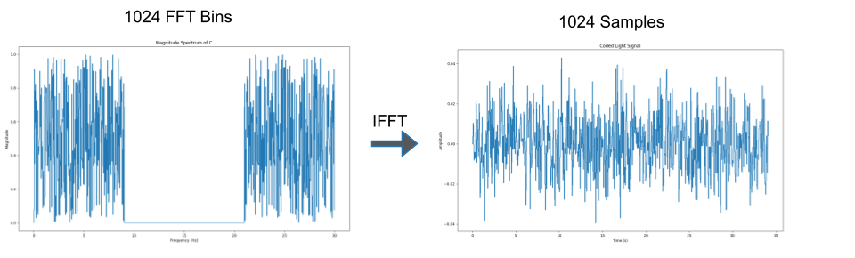 | 
|:--:| 
| Figure 2. Code Signal Generation |

To record a video, a scene is illuminated with the noise coded light source. Any light source can be used but we chose an LCD monitor for convenience. Video is recorded using iPhone 13/15/17 at 30fps in 1080p resolution. The video is exported as a .mov file.

### **3.2 Tamper Detection Algorithm**

| 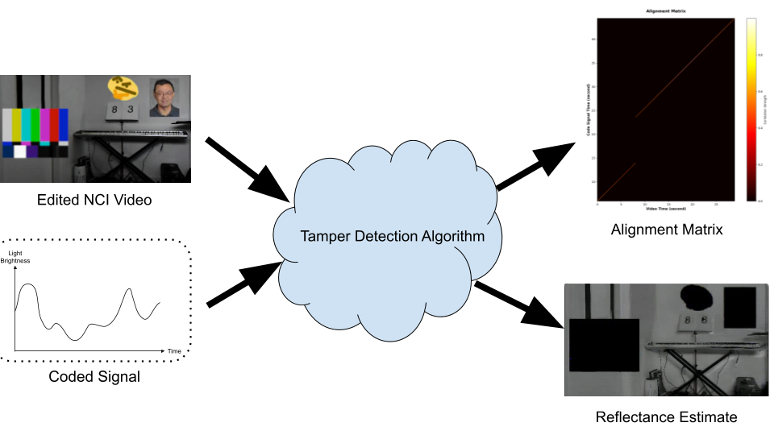 | 
|:--:| 
| Figure 3. Tamper Detection Algorithm |

The goal of the tamper detection algorithm (src/analyze.py) is to generate an Alignment Matrix and Reflectance Estimate given a video and a code signal. The Alignment Matrix detects temporal manipulation while Reflectance Estimate detects spatial manipulation.

The first step in the tamper detection algorithm is to preprocess the video file. Figure 4 shows the video preprocessing pipeline. Preprocessing is required to reduce computation time and resource usage. It also serves to amplify the watermarking signal we want for generating the Alignment Matrix.  

| 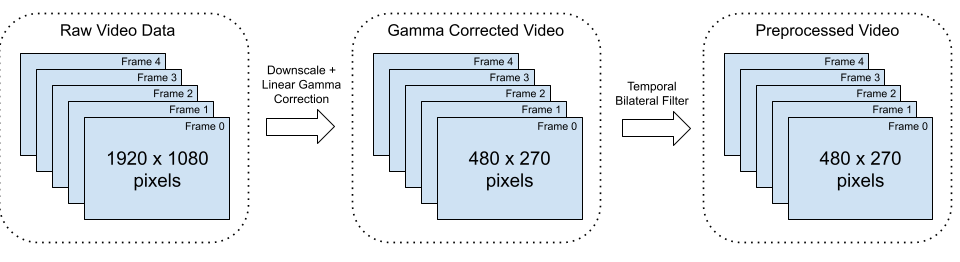 | 
|:--:| 
| Figure 4. Video Preprocessing Pipeline |

The video file is loaded into memory as a 4-dimensional uint8 pixel array where the 4 dimensions are frame number (n), pixel height location (y), pixel width location (x), and color channel (rgb). Resolution is reduced by 4x by decimating in x and y direction. Linear gamma correction is applied by normalizing each pixel and raising the value to a power of 2.2. Temporal Bilateral Filter is applied to all pixels using a temporal window size of 5 with temporal and range sigma values 0.5 and 0.03 respectively. Temporal window size of 5 is chosen to match the bilateral filter parameter from Michael’s paper while temporal and range sigma values were chosen arbitrarily.

The math for Alignment Matrix and Reflectance Estimate is extensively covered in Michael's paper; as such, the derivation will be skipped. Instead, we will cover how the "Global Vector y" is generated from the preprocessed video file. Global vector y represents a 1-d representation of the video where each value represents a single frame.

We first separate the color components of the video to get 3 separate videos. The three videos are converted to three 1-d vectors by taking the average brightness of each frame. The three 1-d vectors are then normalized individually and averaged to create a single 1-d "Global Vector y". This process ensures each channel contributes equally to the final signal, regardless of its inherent brightness or variation. By normalizing each channel independently, it’s equivalent as "Treat variations in red, green, and blue equally, regardless of their absolute brightness levels." This makes the alignment more robust to color imbalances in your camera.

For Alignment Matrix, we chose a window size of 511 because Michael’s paper chose a window size of 450 and we wanted to round up to the nearest power-of-2. For the Reflectance Estimate, we chose a window size of 127 because it empirically produced the best looking results compared to other powers-of-2 sized windows.

## **3.3 Testing & Attacking NCI Setup**

#### **3.3.1 Code Signal Extraction Attack**

If the adversary can obtain the code signal, they can embed the code signal into a new video and pose it as authentic. For example, the adversary can recreate the scene from the original video but with some malicious modifications. Assuming the code signal is private to the authors of the original video, the adversary will have to extract/estimate it from the video alone. Then, the adversary can film a new video containing any content they desire, embedding the code signal into this new video by illuminating the scene with the extracted code signal.

Thus, conceptually, this attack can be separated into two main parts that we can evaluate both separately and together across the full attack pipeline: (1) Extracting/estimating the code signal from the original video and (2) embedding this extracted code signal into a new video that they film, which we denote as phase 1 and phase 2 respectively. Figure 5 illustrates the code signal extraction attack pipeline as described here, with the delinieation between phase 1 and phase 2 allowing us to develop methods to evaluate the two phases both separately, as well as together as a part of the full attack pipeline.

| 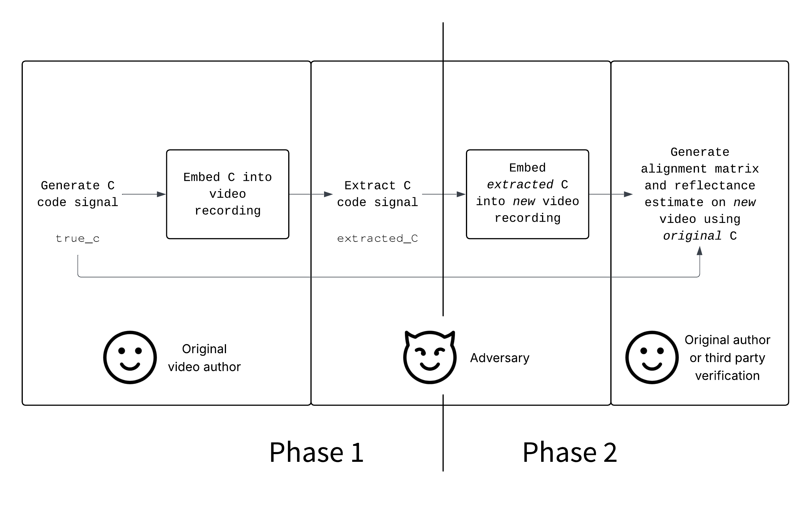 | 
|:--:| 
| Figure 5. Attack pipeline for code signal extraction attack, with delineation between phases 1 and 2 |

##### **3.3.1.1 Phase 1**

To provide a basic demonstration of phase 1, we first start by attempting to extract/estimate the code signal of a simple NCI video setup where the code signal is displayed from a computer monitor, through the modulation of its brightness, onto a sheet of blank white paper, which is then recorded as our original watermarked video. We denote the original code signal that is embedded into this original video as `true_c`, and this first video is available at Figure 6.

| [c_paper.mov](https://drive.google.com/file/d/1wb8dgV80P8AIw3BpS2pH1E1TQKEPrEFt/view?usp=sharing) | 
|:--:| 
| Figure 6. Original c_paper.mov NCI video |

Taking on the role of an adversary, we extract the code signal from this original NCI video following a similar process as that of the alignment matrix processing, where frames are averaged to yield a "Global Vector y" (as described in Section 3.2), which we found that for the purposes of this code signal extraction attack, already serves as quite a good estimate of the orignal code signal. In fact, we've found in our experimentaton that even without any of the video preprocessing outline in Section 3.2, and even without averaging across each color channel separately, this "Global Vector y" already provides an estimate that is remarkably close to the original `true_c`, and is sufficient for the success our attack across both phases 1 and 2. As such, we utilize this vector as our estimate of the code signal c, and denote it as `extracted_c`. The code that does this processing is provided in `src/extract_c.py`, and as we discuss in the Evaluation section (Section 4.1) as well, if such a "worst case" attack pipeline for phase 1 where an attacker may not have full knowledge of the NCI tamper detection algorithm and only uses minimal processing is already able to succeed in attacking NCI, this would reveal a critical weakness in this NCI watermarking technique when it comes to this use case of serving as a "signature" of authenticity of having been filmed by the original video author.

The results of this phase 1 attack, as well as an evaluation with metrics we use to quanitify the difference between our extracted `extracted_c` signal and the original `true_c` signal, are discussed in Section 4.1.1.

##### **3.3.1.2 Phases 1 + 2 Full Attack Pipeline**

We then move on to a more sophisticated scenario involving a more complicated scene, and evaluate our attack pipeline across both phases, 1 and 2. This original video with embedded orignal code signal `true_c` with a more complicated scene involving a few items in a home setting, including a piano, is available at Figure 7.

| [y2.mov](https://drive.google.com/file/d/1zj8xVAcDKANBuuVI78bFy303Uho8n7z5/view?usp=sharing) | 
|:--:| 
| Figure 7. Original y2.mov NCI video |

Now taking on the role of an adversary, we again extract/estimate the code signal following the exact same process as in Section 3.3.1.1, yielding an extracted signal `extracted_c`, and again with analysis and metrics in the Evaluation section under Section 4.1.2.

Then, moving on to phase 2, we take this extracted signal, and from the perspective of an adversary, now display this `extracted_c` on a computer monitor and embed it into another, completely different scene and setting, this time involving stuffed toys. This new video embedded with our extracted code signal `extracted_c` is available at Figure 8.

| [c1/reconstructed/reconstructed_y.mov](https://drive.google.com/file/d/19rvLuILlJcrDHNzORxnlnrnBckVh_-qP/view?usp=sharing) | 
|:--:| 
| Figure 8. c1/reconstructed/reconstructed_y.mov NCI video with embedded `extracted_c`, created by an adversary |

Finally, to evaluate how succesfully an adversary is able to pass this video containing this extracted code signal `extracted_c` off as authentic, we take the perspective of the original author or some other trusted third party that has access to the original, authentic `true_c` and wishes to use it to verify the authenticity of the video, by using this `true_c` to generate an alignment matrix and reflectance estimate for this adversarial c1/reconstructed/reconstructed_y.mov video, following the exact same alignment matrix and reflectance estimate generation process as outlined in Section 3.2, including any preprocessing. We present our results and evaluation of this in the Evaluation section under Section 4.1.2.

##### **3.3.1.3 Effect of Code Signal Amplitude on Code Signal Extraction Attack Pipeline**

Finally, we also perform experiments to evaluate the effect of varying code signal amplitudes, resulting in different levels of brightness variation of the code signal watermarking in original, authentic NCI videos, on our code signal extraction attack pipeline.

We again start with phase 1, with videos embedded with an original code signal `true_c`, but this time we have four videos, with the amplitude of the code signal that is shined onto each of the scene being scaled by a factor of 0.5, 0.25, 0.125, and 0.0625, respectively. The corresponding videos are provided respectively at Figures 9, 10, 11, and 12, and as can be seen from visual inspection of the videos as well, as expected, the videos with lower amplitude code signal show less obvious variations/fluctuations in the brightness of the scene.

| [38_0.5c.mov](https://drive.google.com/file/d/1xDdMTnDmlq1hZBcAsxq7W4B4aiTOttYs/view?usp=sharing) | 
|:--:| 
| Figure 9. Original NCI video for code signal amplitude 0.5 |

| [38_0.25c.mov](https://drive.google.com/file/d/1HmTxw7ePszG5Em66RnlV1T1IkzS_f_PN/view?usp=sharing) | 
|:--:| 
| Figure 10. Original NCI video for code signal amplitude 0.25 |

| [38_0.125c.mov](https://drive.google.com/file/d/19wxn3Rm92Nv7BeHhq6hVRW42PAcl6F8R/view?usp=sharing) | 
|:--:| 
| Figure 11. Original NCI video for code signal amplitude 0.125 |

| [38_0.0625c.mov](https://drive.google.com/file/d/1UvDz3i4oVoGVI6GdIt0YpvJQ-mBXPW2S/view?usp=sharing) | 
|:--:| 
| Figure 12. Original NCI video for code signal amplitude 0.0625 |

We again follow the same process of extracting the code signal from the perspective of an adversary, yielding `extracted_c`, for each of the four videos, with analysis and metrics in the Evaluation section under Section 4.1.3.

Here, we present our process going through phase 2 with the video with the lowest code signal amplitude (0.0625), where if we find that the `extracted_c` extracted from this lowest amplitude video, when embedded by an adversary into their own video, still results in alignment matrices and reflectance estimates generated with `true_c` that someone authenticating the video would have expected to come from the original video filmed by the original video author, then this, as we discuss in the Evaluation section (Section 4.1) as well, presents another critical weakness of this NCI watermarking technique, where even at low amplitudes, the code signal can still be extracted/estimated sufficiently close to the original code signal `true_c` such that a video filmed by an adversary that embeds this extracted code signal can still be passed off as authentic when verified through the generation of an alignment matrix and reflectance estimate of the video against the original code signal `true_c`. The video embedded with this `extracted_c`, extracted from the 0.0625 amplitude code signal video, is provided at Figure 13.

| [c4/reconstructed/reconstructed_y.mov](https://drive.google.com/file/d/1AgTltSoaEuGIp08rQf3s8dTQqdm5BdWx/view?usp=sharing) | 
|:--:| 
| Figure 13. c1/reconstructed/reconstructed_y.mov NCI video with embedded `extracted_c`, extracted from 38_0.0625c.mov, created by an adversary |

Finally, once again, from the perspective of the original author or some other trusted third party that has access to the original, authentic `true_c` and wishes to use it to verify the authenticity of the video, we generate an alignment matrix and reflectance estimate for this adversarial c4/reconstructed/reconstructed_y.mov video against the original `true_c`, and present our results and evaluation of in the Evaluation section under Section 4.1.3.

#### **3.3.2 Spatial Manipulation Attacks**

In these attacks, we try to modify the original videos 38.mov and 71.mov to look like the reference fake images without breaking the NCI watermarks.

| [38.mov](https://drive.google.com/file/d/1M3-XnYjwmPRevkagAO9qwEyS2kSNT7lL/view?usp=drive_link) | 
|:--:| 
| Figure 14. Original NCI video of 38 |

| 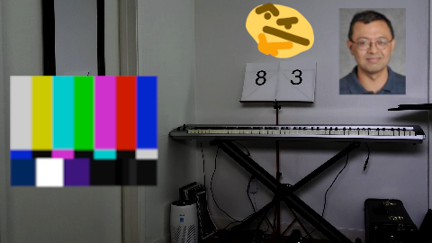 | 
|:--:| 
| Figure 15. Reference fake image for 38|

| [71.mov](https://drive.google.com/file/d/12EUDaK7nZaBm_MIdmGbFvZ5oXLJWw-2P/view?usp=drive_link) | 
|:--:| 
| Figure 16. Original NCI video of 71 |

|  | 
|:--:| 
| Figure 17. Reference fake image for 71|

##### **3.3.2.1 Basic Overlay**

| [38_edited_basic.mp4](https://drive.google.com/file/d/1tQ8dilikBapwO6TSMCJP626tAS2nDoLz/view?usp=drive_link) | 
|:--:| 
| Figure 18. 38.mov modified using basic overlay |

| [71_edited_basic.mp4](https://drive.google.com/file/d/1vwgWdx8SmJFW_6YI75omu3USsxOFjF6p/view?usp=drive_link) | 
|:--:| 
| Figure 19. 71.mov modified using basic overlay |

Basic Overlay attack serves as our baseline/control experiment. Overlaying is the simplest form of pixel modification where the original pixel value is simply overwritten with the desired pixel value. In this attack, any pixel that has been edited stays constant throughout the video.

##### **3.3.2.2 Pixel Multiplication**

| [38_edited_mult.mp4](https://drive.google.com/file/d/1uHHq2SyGAReCZ7RXghau-agn06E7j4AO/view?usp=drive_link) | 
|:--:| 
| Figure 20. 38.mov modified using pixel multiplication |

| [71_edited_mult.mp4](https://drive.google.com/file/d/17pV09PFJojmHNaAQHVy72yJzt3k1CE2m/view?usp=drive_link) | 
|:--:| 
| Figure 21. 71.mov modified using pixel multiplication |

Pixel multiplication attack modifies a pixel by multiplying its value with some constant alpha such that the final value matches the desired pixel value. alpha > 1 will make the pixel brighter while alpha < 1 will make the pixel dimmer. Each color channel can be multiplied independently to produce a wide range of colors. The premise behind this attack is that multiplying a pixel value by alpha is mathematically equivalent to a pixel under the same code signal but with the reflectance and noise scaled by alpha.

\[
\begin{aligned}
y &= lr + cr + n\\
\alpha y &= l(\alpha r) + c(\alpha r) + \alpha n\\
&= lr' + cr' + n'
\end{aligned}
\]

Multiplication attacks can produce a wide range of new colors but have one critical flaw. Black pixels can’t be modified because no coefficient can raise the pixel value since 0 times any alpha is still 0.

##### **3.3.2.3 Pixel Sampling**

| [38_edited_sampling.mp4](https://drive.google.com/file/d/1Vf3OsPQHeFgiCBzw-Ka6SFFwafe8jNQx/view?usp=drive_link) | 
|:--:| 
| Figure 22. 38.mov modified using pixel sampling |

| [71_edited_sampling.mp4](https://drive.google.com/file/d/1W_QdovqhxcBQrhdYlYCP6IU2cmQ2yr1f/view?usp=drive_link) | 
|:--:| 
| Figure 23. 71.mov modified using pixel sampling |

Pixel sampling modifies a pixel by replacing it with another pixel from the same video that appears closest to the desired pixel. Color closeness can be defined as either the Euclidean distance between two color vectors or as the angle difference between the two color vectors. The premise behind this attack is that the replaced pixel is authentic and contains the correct watermark, so the replaced pixel and the source pixel should be indistinguishable in the Alignment Matrix and Reflectance Estimate.

The sampling attack tends to look more natural than multiplication attack, but suffers from a limited color palette. The attack cannot generate new colors that are not already in the original video.

##### **3.3.2.4 Pixel Sampling + Multiplication**

| [38_edited_sampling_mult.mp4](https://drive.google.com/file/d/1c9GZ5Hwqy3Y4azfgi7JGC7BIhy3PX_Uh/view?usp=drive_link) | 
|:--:| 
| Figure 24. 38.mov modified using pixel sampling + multiplication |

| [71_edited_sampling_mult.mp4](https://drive.google.com/file/d/1hTYSCr0sIotjzVKb_edzKM9ds5cwCqVf/view?usp=drive_link) | 
|:--:| 
| Figure 25. 71.mov modified using pixel sampling + multiplication |

This attack combines the Pixel Sampling and Multiplication Attacks. The original video is first processed by the Sampling Attack, generating an intermediate version. This output is then fed into the Multiplication Attack to produce the final video. Combining two attacks has the benefit of complementing each attack’s weakness.  For instance, the Multiplication Attack cannot scale a pixel with a value of [0,0,0], as multiplying zero yields no change; however, the preceding Sampling Attack can replace such pixels with a non-zero pixel from the original frame. Additionally, while sampling suffers from a limited color palette, multiplication expands the range of color values, potentially broadening the overall color spectrum. A noted drawback of this combined approach is some loss of texture and facial detail due to error accumulation from each attack.

---

# **4. Evaluation & Results**

### **4.1 Code Signal Extraction Attack Result**

#### **4.1.1 c_paper.mov Phase 1**

| 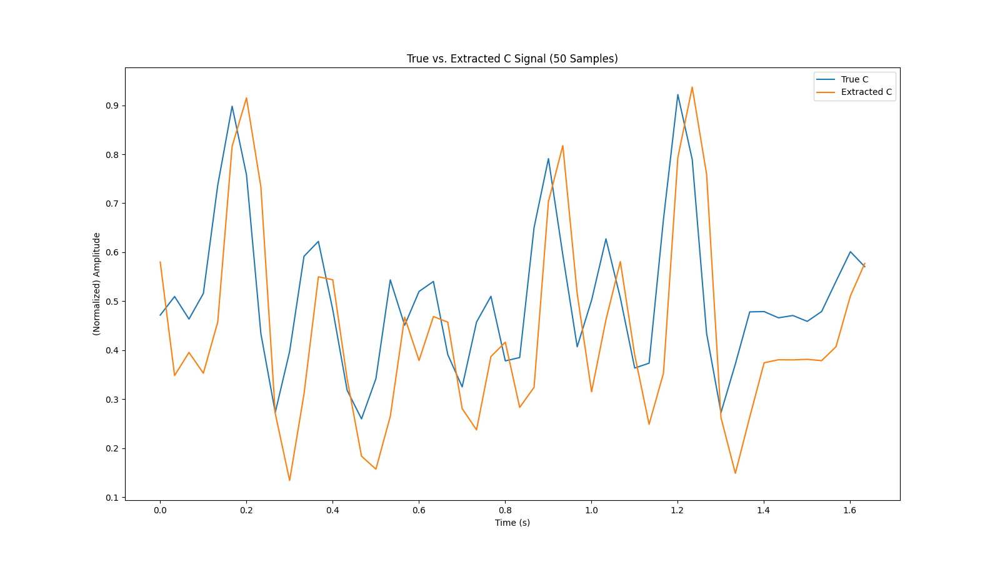 | 
|:--:| 
| Figure 26. Extracted vs. true (original) code signal (both normalized to 0-1) for c_paper.mov, plotted for 50 samples |

RMSE: 0.137713

As can be seen from Figure 26, when both have their amplitudes normalized to range from 0 to 1, the extracted code signal `extracted_c`, extracted from c_paper.mov, matches quite closely to the original code signal `true_c` that the original video author used to embed in their video.

To quantify this "closeness," we use the Root Mean Square Error (RMSE) between the normalized `extracted_c` and `true_c` signals, formulated as:

$$ RMSE = \sqrt{\frac{\sum_{i=1}^N (c_i - \hat{c}_i)^2}{N}}, $$

where *N* is the total number of samples of overlap between the original `true_c` and the extracted `extracted_c` (the length of `true_c` ≥ the length of `extracted_c`, since the video recording starts at or sometime after the beginning of the `true_c` signal and ends at or sometime before the end of the `true_c` signal), *cᵢ* are the *i = 1, 2, ..., N* samples of `true_c` that overlap with `extracted_c`, and *ĉᵢ* are the *i = 1, 2, ..., N* samples of `extracted_c` that overlap with `true_c`, and we see that we achieve a relatively low RMSE of 0.137713.

The code that does this comparison between `true_c` and `extracted_c` -- normalizing, aligning, plotting, and calculating RMSE -- is also provided in `src/extract_c.py`.

#### **4.1.2 y2.mov Phases 1 + 2 Full Attack Pipeline**

| 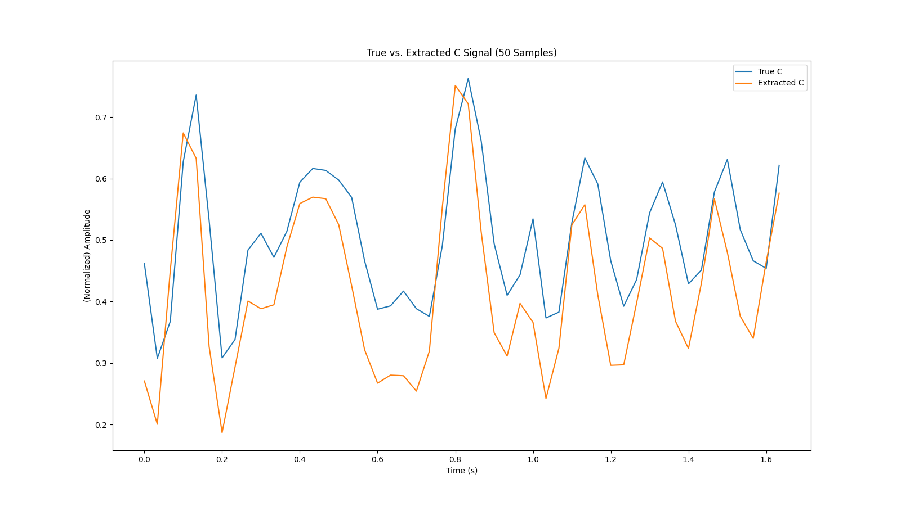 | 
|:--:| 
| Figure 27. Extracted vs. true (original) code signal (both normalized to 0-1) for y2.mov, plotted for 50 samples |

RMSE: 0.120240

Again, as in Section 4.1.1, as can be seen from Figure 26, when both have their amplitudes normalized to range from 0 to 1, the extracted code signal `extracted_c`, extracted from y2.mov, matches quite closely to the original code signal `true_c` that the original video author used to embed in their video, and we achieve a relatively low RMSE between the two signals of 0.120240.

| 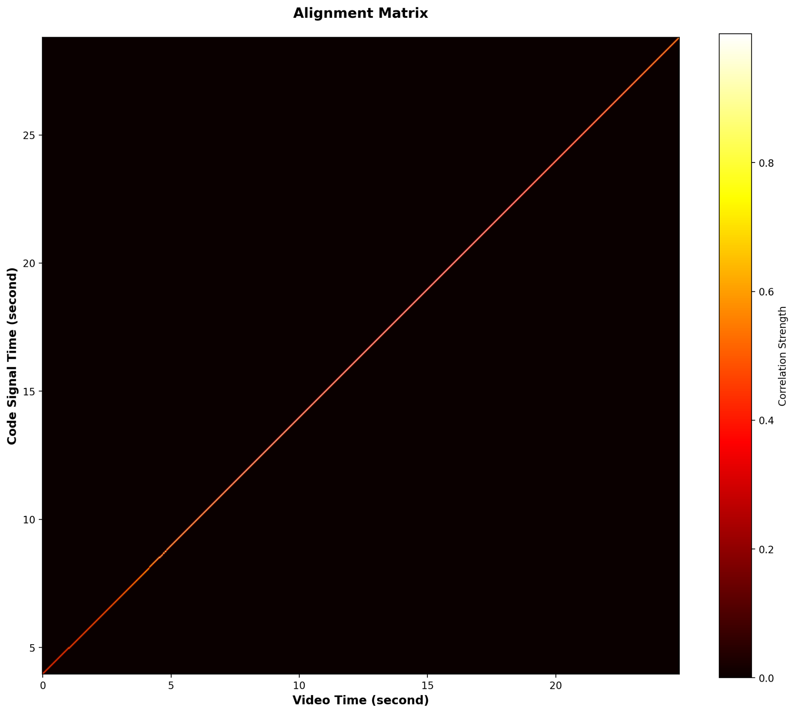 | 
|:--:| 
| Figure 28. Alignment Matrix of c1/reconstructed/reconstructed_y.mov, against `true_c` |

| [y2_reconstructed_y_r_estimate.mp4](https://drive.google.com/file/d/1rmmPqn_NFeBwPFbIrErrQkSCdBHMDjPQ/view?usp=sharing) | 
|:--:| 
| Figure 29. Reflectance Estimate of c1/reconstructed/reconstructed_y.mov, against `true_c` |

As can be seen from Figure 28, the alignment matrix generated using `true_c` for the c1/reconstructed/reconstructed_y.mov video filmed by the adversary embedded with `extracted_c` appears as would be expected of the original video filmed by the original video author embedded with `true_c`, with a line at unity and no other obvious artifacts. Similarly, as can be seen from Figure 29, the reflectance estimate generated using `true_c` for the c1/reconstructed/reconstructed_y.mov video filmed by the adversary embedded with `extracted_c` appears as would be expected of the original video filmed by the original video author embedded with `true_c`, with no obvious black spots in the image that would signify anything out of the ordinary.

Thus, our attack is successful, where, given an NCI video with embedded `true_c` filmed by the original video author, an adversary is able to successfully extract/estimate an `extracted_c` that is very close to the original `true_c`, and that, when embedded into a new video filmed by the adversary, still results in alignment matrices and reflectance estimates generated with `true_c` that someone authenticating the video would have expected to come from the original video filmed by the original video author.

Ultimately, this reveals a critical weakness in the NCI watermarking technique in serving as a "signature" to authenticate the authenticity of a video as having been recorded by the original author, especially as an adversary can perform this attack even with a relatively simple, unsophisticated code signal extraction algorithm, including one that does minimal processing on the NCI-watermarked video and simply averages frames of the video to estimate the embedded code signal.

#### **4.1.3 Effect of Code Signal Amplitude on Code Signal Extraction Attack Pipeline**

| 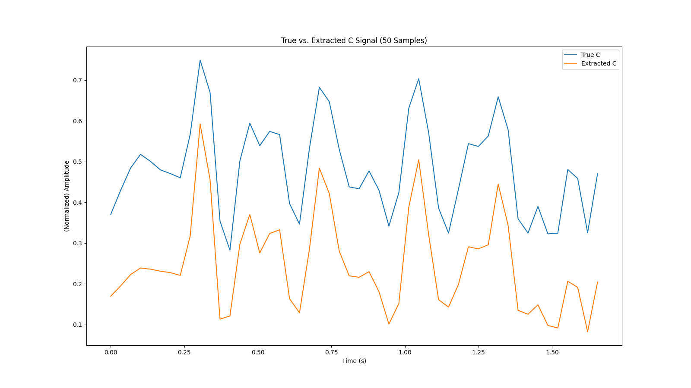 | 
|:--:| 
| Figure 30. Extracted vs. true (original) code signal (both normalized to 0-1) for 38_0.5c.mov, plotted for 50 samples |

RMSE: 0.227480

| 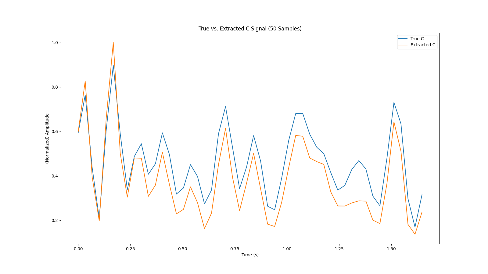 | 
|:--:| 
| Figure 31. Extracted vs. true (original) code signal (both normalized to 0-1) for 38_0.25c.mov, plotted for 50 samples |

RMSE: 0.135825

| 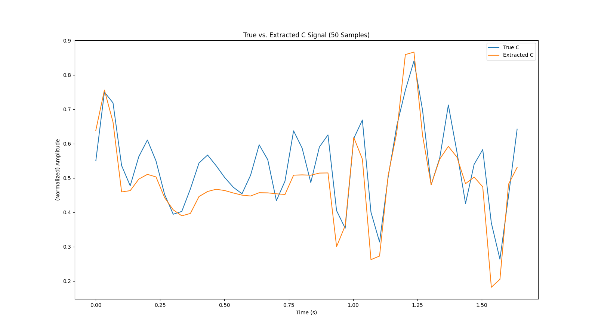 | 
|:--:| 
| Figure 32. Extracted vs. true (original) code signal (both normalized to 0-1) for 38_0.125c.mov, plotted for 50 samples |

RMSE: 0.081673

| 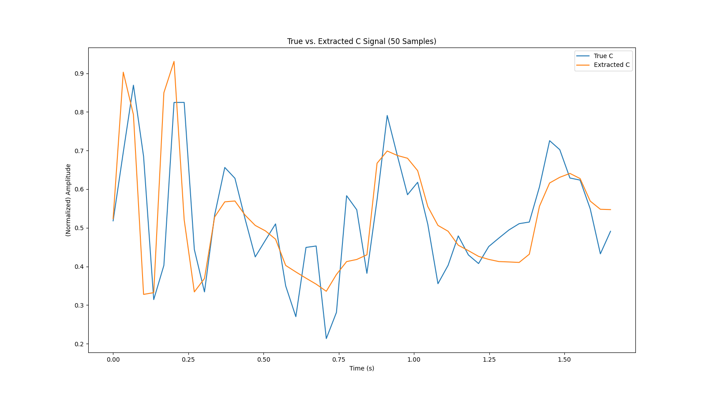 | 
|:--:| 
| Figure 33. Extracted vs. true (original) code signal (both normalized to 0-1) for 38_0.0625c.mov, plotted for 50 samples |

RMSE: 0.107308

As can be seen from Figures 30, 31, 32, and 33, when normalized, the extracted code signal `extracted_c`, extracted from videos, matches relatively closely to the original code signal `true_c` embedded in the video, and we again achieve a relatively low RMSEs between the `true_c` and `extracted_c` signals of 0.227480, 0.135825, 0.081673, and 0.107308 respectively. However, we also observe that for the videos with lower code signal amplitude, particularly with the videos with code signal amplitudes 0.125 and 0.0625, although the shape of the `extracted_c` signal generally matches that of the `true_c` signal, `extracted_c` noticably doesn't quite reach the peaks and valleys of `true_c`, with almost a sort of "smoothing" effect on `extracted_c` compared to `true_c`.

To evaluate how this effects the authentication of a video that an adversary films using this "smoothed" `extracted_c`, we illustrate the results of phase 2 of the attack for the lowest amplitude case of the video with code signal amplitude 0.0625:

|  | 
|:--:| 
| Figure 34. Alignment Matrix of c4/reconstructed/reconstructed_y.mov, against `true_c` |

| [38_0.0625c_reconstructed_y_r_estimate.mp4](https://drive.google.com/file/d/1bnPNm7V3gvnrn78QdApv8cA8dWsHI145/view?usp=sharing) | 
|:--:| 
| Figure 35. Reflectance Estimate of c4/reconstructed/reconstructed_y.mov, against `true_c` |

As can be seen from Figure 34, despite the "smoothing" effect on `extracted_c`, the alignment matrix generated using `true_c` for the c4/reconstructed/reconstructed_y.mov video filmed by the adversary embedded with `extracted_c` appears as would be expected of the original video filmed by the original video author embedded with `true_c`, with a line at unity and no other obvious artifacts. Similarly, as can be seen from Figure 35, despite the "smoothing" effect on `extracted_c`, the reflectance estimate generated using `true_c` for the c4/reconstructed/reconstructed_y.mov video filmed by the adversary embedded with `extracted_c` appears as would be expected of the original video filmed by the original video author embedded with `true_c`, with no obvious black spots in the image that would signify anything out of the ordinary.

Thus, even when the amplitude of the code signal embedded into the original NCI video is low, such that the variations in brightness in the scene are barely noticeable if at all as in 38_0.0625c.mov, our attack is successful, where the adversary is still able to successfully extract/estimate an `extracted_c` that is close enough to the original `true_c` such that when embedded into a new video filmed by the adversary, it still yields alignment matrices and reflectance estimates generated with `true_c` that someone authenticating the video would have expected to come from the original video filmed by the original video author, with no indication in the aligment matrix and reflectance estimate that anything is out of the ordinary.

Ultimately, this again reveals a critical weakness in the NCI watermarking technique in serving as a "signature" to authenticate the authenticity of a video as having been recorded by the original author, especially as an adversary can perform this attack even when the code signal embedded into the NCI video is low and barely noticeable using a relatively simple, unsophisticated code signal extraction algorithm.

### **4.2 Basic Attack (Control) Results**

Alignment Matrix looks good as expected since there was no temporal manipulation.  
Reflectance Estimate detects spatial manipulation by displaying the edited pixels as black.

|  | 
|:--:| 
| Figure 36. Alignment Matrix of 38_edited_basic.mp4 |

| [38_edited_basic_r_estimate.mp4](https://drive.google.com/file/d/1GdGmzv3FNZcKn_uf_RZE2OYVb1N_r4wi/view?usp=drive_link) | 
|:--:| 
| Figure 37. Reflectance Estimate of 38_edited_basic.mp4 |

| 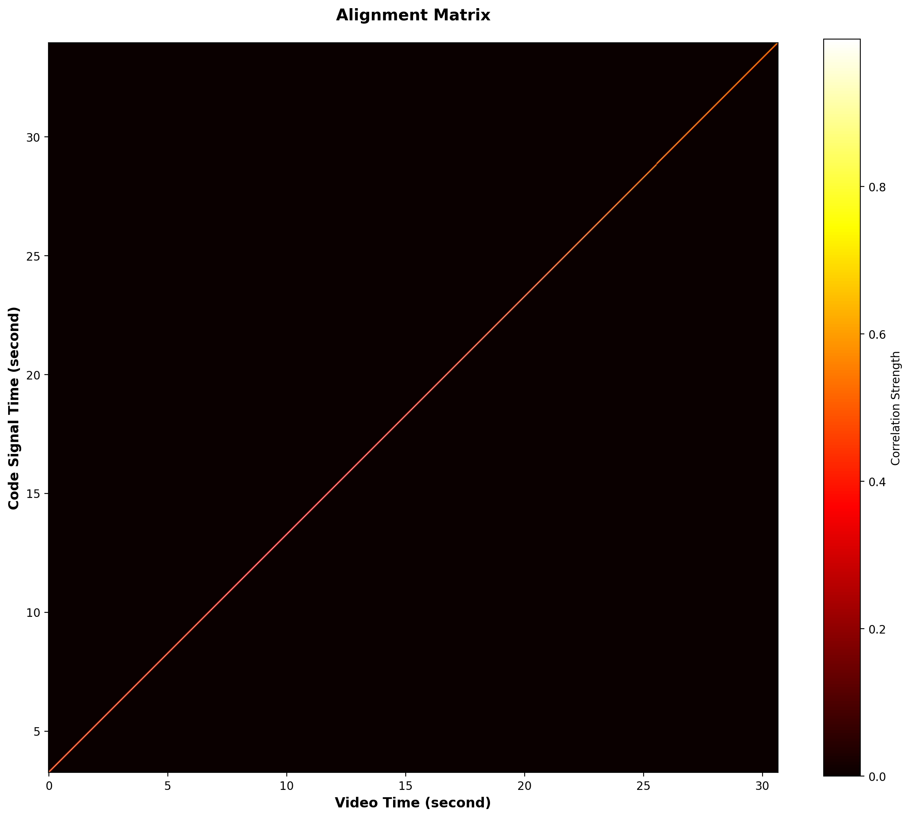 | 
|:--:| 
| Figure 38. Alignment Matrix of 71_edited_basic.mp4 |

| [71_edited_basic_r_estimate.mp4](https://drive.google.com/file/d/1MLhInSva9lvAczQvzLiwuaxXmiU3rYhE/view?usp=drive_link) | 
|:--:| 
| Figure 39. Reflectance Estimate of 71_edited_basic.mp4 |

### **4.3 Pixel Multiplication Attack Results**

Alignment Matrix looks good as expected since there was no temporal manipulation.  
Reflectance Estimate fails to detect spatial manipulation as evidenced by none of the edited pixels being black. This attack bypasses watermarking.

|  | 
|:--:| 
| Figure 40. Alignment Matrix of 38_edited_mult.mp4 |

| [38_edited_mult_r_estimate.mp4](https://drive.google.com/file/d/1w1-8bvPp0EpWTbwP5xwoQG4Rzaiespzy/view?usp=drive_link) | 
|:--:| 
| Figure 41. Reflectance Estimate of 38_edited_mult.mp4 |

|  | 
|:--:| 
| Figure 42. Alignment Matrix of 71_edited_mult.mp4 |

| [71_edited_mult_r_estimate.mp4](https://drive.google.com/file/d/13w5lBSZW_kgxQA9FeZEXYjY8o6U6zM48/view?usp=drive_link) | 
|:--:| 
| Figure 43. Reflectance Estimate of 71_edited_mult.mp4 |

### **4.4 Pixel Sampling Attack Results**

Alignment Matrix looks good as expected since there was no temporal manipulation.  
Reflectance Estimate fails to detect spatial manipulation as evidenced by none of the edited pixels being black. This attack bypasses watermarking.

|  | 
|:--:| 
| Figure 44. Alignment Matrix of 38_edited_sampling.mp4 |

| [38_edited_sampling_r_estimate.mp4](https://drive.google.com/file/d/1WxLQ1n6yguzkJNoDNSQymLZ2_apyN4gr/view?usp=drive_link) | 
|:--:| 
| Figure 45. Reflectance Estimate of 38_edited_sampling.mp4 |

|  | 
|:--:| 
| Figure 46. Alignment Matrix of 71_edited_sampling.mp4 |

| [71_edited_sampling_r_estimate.mp4](https://drive.google.com/file/d/1-m5RIv6IE9D8cJTqp7EHfET1hDmOT4BF/view?usp=drive_link) | 
|:--:| 
| Figure 47. Reflectance Estimate of 71_edited_sampling.mp4 |

### **4.5 Pixel Multiplication + Sampling Attack Results**

Alignment Matrix looks good as expected since there was no temporal manipulation.  
Reflectance Estimate fails to detect spatial manipulation as evidenced by none of the edited pixels being black. This attack bypasses watermarking.

|  | 
|:--:| 
| Figure 48. Alignment Matrix of 38_edited_sampling.mp4 |

| [38_edited_sampling_mult_r_estimate.mp4](https://drive.google.com/file/d/12FuLq4AwDjDIo_oq-uR6NVYgyKB8aj5g/view?usp=drive_link) | 
|:--:| 
| Figure 49. Reflectance Estimate of 38_edited_sampling.mp4 |

|  | 
|:--:| 
| Figure 50. Alignment Matrix of 71_edited_sampling.mp4 |

| [71_edited_sampling_mult_r_estimate.mp4](https://drive.google.com/file/d/1EY7l4lmPNed0bFg5f--8PENJNnz4PJf6/view?usp=drive_link) | 
|:--:| 
| Figure 51. Reflectance Estimate of 71_edited_sampling.mp4 |

### **4.6 Attack Comparison**

| [r_estimate_ideal.mp4](https://drive.google.com/file/d/1WP6zTy2rGOlHNjOe0Gv6BwDmAhLKxxbv/view?usp=drive_link) | 
|:--:| 
| Figure 52. Ideal Reflectance Estimate of 38_edited_mult.mp4 |

| [r_estimate_actual.mp4](https://drive.google.com/file/d/1w1-8bvPp0EpWTbwP5xwoQG4Rzaiespzy/view?usp=drive_link) | 
|:--:| 
| Figure 53. Actual Reflectance Estimate of 38_edited_mult.mp4 |

To quantify the effectiveness of our attacks, we measured the error between a theoretical ideal Reflectance Estimate and the actual Reflectance Estimate of the edited videos. In an ideally working NCI tamper detection algorithm, the reflectance estimate would show any edited pixels as permanently black. We measure deviation of our actual reflectance estimate from ideal using RMSE. The table below lists the RMSE values for each video and attack combination we tried. Higher RMSE indicates more deviation from ideal and roughly translates to better attack. Note however that there are likely better metrics that consider the brightness fluctuations of the edited pixels in the Reflectance Estimate.

|        | Basic   | Multiplication | Sampling | Sampling + Multiplication |
|--------|---------|----------------|----------|---------------------------|
| 38.mov | 0.03837 | 0.10109        | 0.06702  | 0.17614                   |
| 71.mov | 0.01069 | 0.14768        | 0.13987  | 0.13990                   |

### **4.7 Computational Overhead of Attacks**

T = number of frames, H = height of each frame, W = width of each frame

| Method                        | Big-O Complexity        |
|-------------------------------|-------------------------|
| Code Signal Extraction        | `O(H·W)`                |
| Basic Overlay                 | `O(H·W)`                |
| Pixel Multiplication          | `O(H·W)`                |
| Pixel Sampling                | `O((H·W)²)`             |
| Pixel Sampling + Multiplication | `O((H·W)² + H·W)`     |

---

# **5. Discussion & Conclusions**

### **5.1 Potential Defense Strategy**

The code signal extraction attack works because the code signal is independent of the scene being captured. A possible defense would disallow reusing a single code signal across multiple scenes. Our proposed solution is to make the code signal a direct function of the scene. For example, in our implementation of the code signal, a hash of the last recorded frame can be used as a seed for generating the next 1024 samples of the code signal. Even though extracting the code signal is easier, reusing the extracted code signal is much more difficult because the adversary also has to match the hash of the scene.

The code signal only applies the watermark over time. If the watermark can be applied across space, it could provide some defense against sampling attack. For example, instead of shining a light that appears constant throughout space, a QR-code-like pattern can be projected to the scene. If a pixel is modified using sampling attack, the QR code pattern will become invalid and sampling attack can be detected.

Pixel multiplication attack can be detected by exploiting the fact that noise variance is scaled by alpha^2. In an unmodified video, the variance of all the pixels should be identical because each pixel receives equal noise and noise coded light. If a pixel was modified by multiplication attack, the variance of that pixel will be scaled by a factor of alpha^2 compared to the variance of other pixels.

### **5.2 Multiple Noise Coded Light Sources**

Multiple noise coded light sources can defend against our implementation of code signal extraction. We extracted the code signal by averaging the brightness of each frame. However, if there are multiple coded light sources, the same method will extract the average value of all code signals. To extract individual code signals, we would need a function that decomposes an average value into individual components, but since all code signals are uncorrelated, the search space would be too large to accomplish the decomposition reliably.

Multiple noise coded light sources can not defend against pixel multiplication and sampling attack. Even with multiple light sources, multiplying pixel by alpha is equivalent to scaling the reflectance and noise for each individual light source by alpha while keeping the noise code identical. Replacing a pixel illuminated by multiple light sources maintains the NCI watermark of that pixel because the location of the pixel has no effect on the pixel’s authenticity.

### **5.3 What Worked Well and Why**

- Reproduce NCI Pipeline: implemented a workable version of NCI, including alignment matrix generation and reflectance estimation 
- Code signal extraction attack: Code signal can be extracted even if the amplitude is low. 
- Pixel sampling+multiplication attack: Some edits using this attack are very hard to perceive by eye. Attack combines the best parts of the two individual attacks.

### **5.4 What Didn’t Work**

We couldn’t use LED stage lights as our noise coded light source because the LED could not be dimmed faster than 2 Hz.

### **5.5 Limitations of Our Work**

-Static Scenes: all videos are recorded with static scenes, which limits the generalizability of our findings. 
-Controlled Lighting: attacks are performed under ideal illumination. Real-world conditions with shadows could affect both attack feasibility and NCI’s robustness.

### **5.6 Future Work**

-Incorporate Motion: test attacks in dynamic scenes with moving objects and cameras
-Conduct Human Studies: evaluate the perceptual stealth of the attacks through user studies to measure real-world detectability. 
-Integrate setups where multiple code signals are within the same video, and evaluate attacks against such scenarios
-Full stage-light + ESP32 control setup

---

# **6. References**  
[1] Michael, Peter, Zekun Hao, Serge Belongie, and Abe Davis. "Noise-Coded Illumination for Forensic and Photometric Video Analysis." ACM Transactions on Graphics 44, no. 5 (2025): 1-16. https://dl.acm.org/doi/pdf/10.1145/3742892

[2] Ponni alias Sathya, S., and S. Ramakrishnan. "Fibonacci based key frame selection and scrambling for video watermarking in DWT–SVD domain." Wireless Personal Communications 102.2 (2018): 2011-2031.

[3] Prasetyo, Heri, Chih-Hsien Hsia, and Chin-Hua Liu. "Vulnerability attacks of SVD-based video watermarking scheme in an IoT environment." IEEE Access 8 (2020): 69919-69936.

[4] Aberna, P., and Loganathan Agilandeeswari. "Digital image and video watermarking: methodologies, attacks, applications, and future directions." Multimedia Tools and Applications 83.2 (2024): 5531-5591.

[5] Hartung, Frank, and Bernd Girod. "Watermarking of uncompressed and compressed video." Signal processing 66.3 (1998): 283-301.

[6] Doerr, Gwenael, and Jean-Luc Dugelay. "A guide tour of video watermarking." Signal processing: Image communication 18.4 (2003): 263-282.

[7] Doërr, Gwenaël, and J-L. Dugelay. "Security pitfalls of frame-by-frame approaches to video watermarking." IEEE Transactions on Signal Processing 52.10 (2004): 2955-2964.

---

# **7. Supplementary Material**

## **7.a. Datasets**

### **Internal NCI Video Dataset**

**Source and Collection:**
- **Origin:** Original videos captured in-house using iPhone 13, 15, and 17 devices
- **Capture Setup:** Scenes illuminated with noise-coded light signal displayed on an LCD monitor; videos recorded at 30 fps in 1080p (1920×1080) resolution
- **Video Identifiers:** 38.mov, 71.mov; paper_c.mov, y2.mov, 38_0.5c.mov, 38_0.25c.mov, 38_0.125c.mov, 38_0.0625c.mov (original, unmodified NCI videos); c1/reconstructed/reconstructed_y.mov, c4/reconstructed/reconstructed_y.mov (adversary-created NCI videos, with extracted code signal `extracted_c` embeddd into the video, rather than the original `true_c`)
- **Storage:** Available on [Google Drive](https://drive.google.com/drive/u/1/folders/1GjT8bqGzidTatEPVupToLRYUan-t1r35)

**Data Format:**
- **Raw Video:** .mov format (Apple ProRes or H.264 codec)
- **Preprocessed Video:** .mp4 format (H.264 codec) for processed and attacked versions
- **Code Signal:** Generated in frequency domain with 1024 samples, converted to time domain via IFFT; sampled at 30 Hz (matching video frame rate)
- **Derived Outputs:** Alignment Matrix (PNG image), Reflectance Estimate (MP4 video), RMSE metrics

## **7.b. Software**

### **External Libraries**

| Library | Purpose | Usage in Project |
|---------|---------|------------------|
| NumPy | Numerical computing, array operations | Code signal generation, video frame manipulation, windowing |
| OpenCV (cv2) | Video I/O, image processing | Video loading/writing (`load_video`, `write_video`), frame decimation, color conversion (BGR↔RGB) |
| PyTorch | GPU acceleration | Device detection and computation (CUDA, MPS, CPU) for alignment matrix computation |
| SciPy | Signal processing | Temporal resampling of code signals (`scipy.signal.resample`) |
| Matplotlib | Visualization | Plotting alignment matrices, reflectance estimates, and analysis results |

### **Internal Modules**

**Core Analysis & Attack Modules:**

| Module | Functionality |
|--------|---------------|
| **`src/simulate_nci.py`** | NCI simulation pipeline for synthetic videos; generates code signals in frequency domain with IFFT, creates illuminated scenes, outputs video frames |
| **`src/edit_video.py`** | Attack implementation framework; contains basic overlay, pixel multiplication, pixel sampling, and combined attacks|
| **`src/analyze.py`** | Main tamper detection pipeline; loads NCI video and code signal, applies preprocessing, computes Alignment Matrix and Reflectance Estimate |

## **7.c. ESP32 LED Lamp setup**

We initially tried to use an [LED Bay Light](https://a.co/d/5SBchFZ) as our noise coded light source, but we couldn't modulate the brightness faster than 2 Hz. We used an ESP32 to generate the code signal in real-time using the IFFT method covered in section 3.1. The code signal is exported to SD card as a binary file to be used by the tamper detection algorithm. After generating the code signal, the signal is converted into 3.3V 120 Hz PWM whose duty cycle changes at 30 Hz according to the code signal value. The LED brightness is controlled by 0~10V analog signal, so the 3.3V PWM was converted to 10V analog using a [converter circuit](https://a.co/d/gyxr8BR). The ESP32 code can be found in `esp-nci/main` directory.

---
<!-- 
> [!NOTE] 
> Read and then delete the material from this line onwards.

# 🧭 **Guidelines for a Strong Project Website**

- Include multiple clear, labeled figures in every major section.  
- Keep the writing accessible; explain acronyms and algorithms.  
- Use structured subsections for clarity.  
- Link to code or datasets whenever possible.  
- Ensure reproducibility by describing parameters, versions, and preprocessing.  
- Maintain visual consistency across the site.

---

# 📊 **Minimum vs. Excellent Rubric**

| **Component**        | **Minimum (B/C-level)**                                         | **Excellent (A-level)**                                                                 |
|----------------------|---------------------------------------------------------------|------------------------------------------------------------------------------------------|
| **Introduction**     | Vague motivation; little structure                             | Clear motivation; structured subsections; strong narrative                                |
| **Related Work**     | 1–2 citations; shallow summary                                 | 5–12 citations; synthesized comparison; clear gap identification                          |
| **Technical Approach** | Text-only; unclear pipeline                                  | Architecture diagram, visuals, pseudocode, design rationale                               |
| **Evaluation**       | Small or unclear results; few figures                          | Multiple well-labeled plots, baselines, ablations, and analysis                           |
| **Discussion**       | Repeats results; little insight                                | Insightful synthesis; limitations; future directions                                      |
| **Figures**          | Few or low-quality visuals                                     | High-quality diagrams, plots, qualitative examples, consistent style                      |
| **Website Presentation** | Minimal formatting; rough writing                           | Clean layout, good formatting, polished writing, hyperlinks, readable organization        |
| **Reproducibility**  | Missing dataset/software details                               | Clear dataset description, preprocessing, parameters, software environment, instructions   | -->